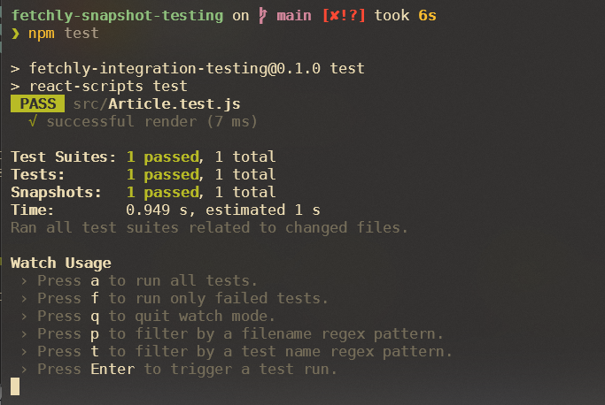
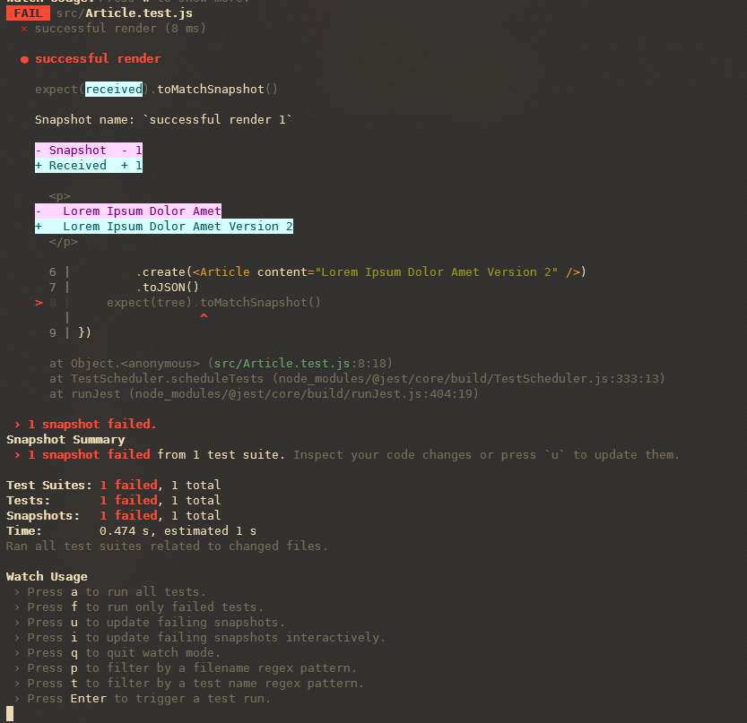

# fetchly-integration-testing

This repository contains the sample code for snapshot testing with React, used in the [Fetchly Labs](https://www.fetch.ly/) tutorial.

It's been bootstrapped with [Create React App](https://github.com/facebook/create-react-app).

## Tutorial

First, make sure you run `npm install react-test-renderer` before developing as it doesn't come pre-installed with Create React App.

The app consists of two components, `App.js` and `Article.js`, of which only the latter will be tested. The article is a simple paragraph tag, that renders a `content` text prop.
This is how App.js and Article.js are structured:
```javascript
// App.js render method
const App = () => {
    const baseText = 'Lorem Ipsum Dolor Amet'
    return (
        <div className='App'>
            <section className='App-body'>
                <section>
                    <Article content={baseText} />
                    <a
                        className='App-link'
                        href='https://github.com/nidnogg/fetchly-snapshot-testing'
                        target='_blank'
                        rel='noopener noreferrer'
                    >
                        Tutorial
                    </a>
                </section>
            </section>
        </div>
    )
}
// Article.js render method
const Article = ({content}) => {
    return (
        <>
            <p>{content}</p>
        </>
    )
}
```

We want to test that the Article component text is consistent when developing and that it doesn't change unexpectedly. i.e. baseText should consistently be *"Lorem Ipsum Dolor Amet"*.

To write a snapshot test for it, a file called `Article.test.js` has to be created.

Inside, the following steps can be followed:

```javascript
import renderer from 'react-test-renderer'
import Article from './Article'
```

Here, we import the `Article` component itself, alongside the renderer from `react-test-renderer`. After the imports, the following clause can be used as a starting point, rendering the Article component:

```javascript
it ('successful render', () => {
    const tree = renderer
        .create(<Article content="Lorem Ipsum Dolor Amet" />)
        .toJSON()
    expect(tree).toMatchSnapshot()
})
```

When this test is executed, a snapshot file under the folder `/src/__snapshots__` will be created. This will be used in future tests, compared with newer snapshots to make sure that the current snapshot matches the intended original one.

This ensures any unexpected changes to your application's UI will be picked up when testing. If the text content of the Article component doesn't match the previous snapshot (in this case, *"Lorem Ipsum Dolor Amet"*) it will fail the test.

In the end, your full test `Article.test.js` should look like this:

```javascript
import renderer from 'react-test-renderer'
import Article from './Article'

it ('successful render', () => {
    const tree = renderer
        .create(<Article content="Lorem Ipsum Dolor Amet" />)
        .toJSON()
    expect(tree).toMatchSnapshot()
})
```

This test can then be run with: 

### `npm test`

A successful test will be then indicated by the following prompt:



If while developing the Article component needs to undergo intended changes to its baseText prop, however, the original snapshot will result in a failed test. For instance, changing the `baseText` prop from *"Lorem Ipsum Dolor Amet"* to *"Lorem Ipsum Dolor Amet Version 2"*, and updating the `Article.test.js` accordingly. This will result in this prompt:



Type in `w`, and you'll be able to see the options at the bottom. If after carefully evaluating the compared output with the previous snapshot you think it's all correctly rendered, press `u` to update the previous snapshot with the current one. This will ensure your future tests will be successfully run.

## Available Scripts (documentation from create-react-app)

In the project directory, you can run:

### `npm start`

Runs the app in the development mode.\
Open [http://localhost:3000](http://localhost:3000) to view it in your browser.

The page will reload when you make changes.\
You may also see any lint errors in the console.

### `npm test`

Launches the test runner in the interactive watch mode.\
See the section about [running tests](https://facebook.github.io/create-react-app/docs/running-tests) for more information.

### `npm run build`

Builds the app for production to the `build` folder.\
It correctly bundles React in production mode and optimizes the build for the best performance.

The build is minified and the filenames include the hashes.\
Your app is ready to be deployed!

See the section about [deployment](https://facebook.github.io/create-react-app/docs/deployment) for more information.

### `npm run eject`

**Note: this is a one-way operation. Once you `eject`, you can't go back!**

If you aren't satisfied with the build tool and configuration choices, you can `eject` at any time. This command will remove the single build dependency from your project.

Instead, it will copy all the configuration files and the transitive dependencies (webpack, Babel, ESLint, etc) right into your project so you have full control over them. All of the commands except `eject` will still work, but they will point to the copied scripts so you can tweak them. At this point you're on your own.

You don't have to ever use `eject`. The curated feature set is suitable for small and middle deployments, and you shouldn't feel obligated to use this feature. However we understand that this tool wouldn't be useful if you couldn't customize it when you are ready for it.

## Learn More

You can learn more in the [Create React App documentation](https://facebook.github.io/create-react-app/docs/getting-started).

To learn React, check out the [React documentation](https://reactjs.org/).
